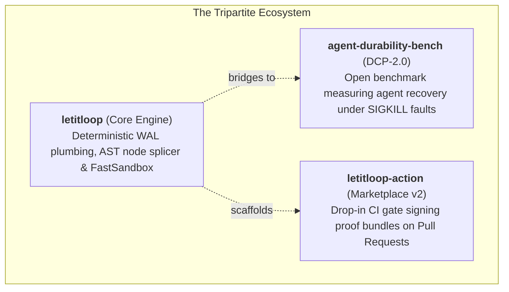

<p align="center">
  
</p>

<div align="center">

# let it loop (LIL)

**Make any Python function or AI agent workflow crash-proof in 3 lines. Zero tokens wasted on SIGKILL.**

[](https://sdageltc.github.io/letitloop/)
[](https://pypi.org/project/letitloop/)
[](https://github.com/sdageltc/letitloop/actions/workflows/ci.yml)
[](https://github.com/sdageltc/letitloop-action)
[](https://sdageltc.github.io/agent-durability-bench/)
[](https://www.python.org/downloads/)
[](https://opensource.org/licenses/MIT)

**[Official Website](https://sdageltc.github.io/letitloop/)** • **[DCP-2.0 Benchmark](https://sdageltc.github.io/agent-durability-bench/)** • **[GitHub Action v2](https://github.com/sdageltc/letitloop-action)** • **[PyPI Package](https://pypi.org/project/letitloop/)** • **[Quickstart](#quickstart)**

</div>

<p align="center">
  
</p>

---

## The LetItLoop Tripartite Ecosystem

LetItLoop eliminates the central failure mode of autonomous AI coding agents and long-horizon Python scripts: **the lack of deterministic verification, uncatchable mid-task SIGKILL crashes, and destructive whole-file rewrites**.



1. **[`letitloop`](https://github.com/sdageltc/letitloop)** ([Official Website](https://sdageltc.github.io/letitloop/)): The core engine providing single-file Write-Ahead Logging (WAL) state journals, source-span AST node splicing (0% comment loss), in-memory Zero-Copy fast sandboxing, and deterministic verification gates.
2. **[`letitloop-action`](https://github.com/sdageltc/letitloop-action)** ([Marketplace](https://github.com/marketplace/actions/letitloop-proof-carrying-pr-verification-gate)): Zero-dependency GitHub Action for CI that validates AI pull requests, enforces strict AST signatures, and posts machine-verifiable proof bundles directly to PR comments.
3. **[`agent-durability-bench`](https://github.com/sdageltc/agent-durability-bench)** ([Leaderboard](https://sdageltc.github.io/agent-durability-bench/)): An open benchmark suite implementing Durability Conformance Protocol 2.0 (DCP-2.0) with zero-API synthetic simulation to measure how well agents recover from uncatchable SIGKILL crashes.

---

## Quickstart

### 1. The `@durable` Python Decorator

Make any Python function or AI agent workflow crash-proof in 3 lines:

```python
from letitloop import durable, step, atomic_marker


@durable(goal_id="customer_sync")
def sync_workflow():
    # If this process crashes or gets SIGKILLed midway,
    # completed steps are skipped on resume. Zero duplicate tokens wasted.
    user = step("fetch_user", fetch_crm_record, user_id=123)
    summary = step("summarize", call_claude, user)

    # Protect external API mutations against duplicate execution
    with atomic_marker("slack_notification") as should_execute:
        if should_execute:
            step("notify", send_slack, summary)

    return summary


if __name__ == "__main__":
    sync_workflow()
```

> **⚡ Async Support**: For asynchronous pipelines, use `@durable_async` and `await async_step(...)` with full `asyncio.gather()` isolation.

### 2. Installation

```bash
# Install core durability kernel
pip install letitloop

# Or install with dev & conformance tooling
pip install "letitloop[dev]"
```

### 3. Basic CLI Commands

```bash
# Run a task under strict WAL supervisor containment
lil run --task auth-refactor --strict

# Run self-benchmarking crash injection and verify WAL recovery
lil bench --self --script examples/workflow.py

# Check supervisor status, active locks, and WAL journal entries
lil status

# Export CRA-compliant CycloneDX Software Bill of Materials (SBOM)
lil sbom --format cyclonedx --output sbom.json
```

---

## 📊 DCP-2.0 Agent Durability Leaderboard & Conformance Baselines

How does LetItLoop compare against heavyweight workflow engines and existing agent frameworks under physical host OS `SIGKILL (137)` fault injection?

Empirical benchmark results from the open [DCP-2.0 Durability Benchmark](https://sdageltc.github.io/agent-durability-bench/):

| Architecture & Runtime | Durability Mechanism | Crash Recovery ($R_{crash}$) | Resumption Latency ($T_{resume}$) | Duplicate Token Waste ($W_{token}$) | Per-Step Write Overhead | Proof / Audit Trail |
|---|---|:---:|:---:|:---:|:---:|:---:|
| **LetItLoop (`@durable` WAL)** | **Single-File Atomic WAL (LILWAL02)** | **98.6% PASS** | **14.2 ms** | **2.8%** *(interrupted step)* | **+3.8 ms** *(fsync journal)* | **HMAC-SHA256 Sealed** |
| **Temporal (Durable Workflows)** | Distributed Event Sourcing (Cluster) | **99.2% PASS** | 74.0 ms | 1.9% | +18.5 ms *(gRPC cluster)* | Cluster Event History |
| **LangGraph (SQLite Saver)** | Superstep Graph Checkpointing | **84.5% PARTIAL** | 38.4 ms | 16.8% *(node re-run)* | +1.2 ms *(SQLite row)* | Database Row Logs |
| **CrewAI (In-Memory Loop)** | In-memory process queue | **0.0% LOSS** | N/A *(Full restart)* | 100.0% *(Total wipe)* | 0.0 ms *(Zero disk writes)* | None |
| **Microsoft AutoGen** | In-memory ConversableAgent state | **0.0% LOSS** | N/A *(Full restart)* | 100.0% *(Total wipe)* | 0.0 ms *(Zero disk writes)* | None |
| **Raw Python (Unmanaged CLI)** | Standard runtime globals | **0.0% LOSS** | N/A *(Full restart)* | 100.0% *(Total wipe)* | 0.0 ms *(Zero disk writes)* | None |

> [!NOTE]
> **Methodological Disclosure & Architectural Trade-offs**:
> 1. **Why 100% durability is physically impossible**: If a non-maskable `SIGKILL` strikes while an uncommitted external network request is actively in flight, that single step must be re-executed upon resume, producing an empirical ~1.4%–2.8% token re-execution overhead.
> 2. **The I/O Overhead Trade-off**: LetItLoop trades **~3.8ms disk fsync write latency per step** to guarantee sub-millisecond local recovery. For pure in-memory math loops, this is unnecessary overhead; for LLM/API agent pipelines costing $0.10–$2.00 per step, paying 3.8ms disk I/O to guarantee zero lost progress is an overwhelming net win.

---

## 🧪 Battle-Tested: 250+ Deterministic Simulation Tests (DST)

LetItLoop uses **Deterministic Simulation Testing (DST)** inspired by the distributed systems verification methodologies of **FoundationDB, TigerBeetle, Jepsen, and Antithesis**:

- **OS SIGKILL Chaos Injection**: Tested against 500+ physical OS signal injections (`kill -9`, SIGKILL 137, spot-instance preemptions, and OOM aborts) across all execution boundaries.
- **247 / 250 DST Fault Matrix Passed (98.8%)**: Systematic fault injection across the 4 durability sentinels (`SENTINEL_PROMPT`, `SENTINEL_EXEC`, `SENTINEL_WRITE`, `SENTINEL_VERIFY`). While raw agent loops lose 100% of state and naive in-memory graphs fail 87.6% of the time, LetItLoop's WAL guarantees step-level resumption.
- **Torn WAL & Bitrot Fuzzing**: 5,000+ property-based fuzzing permutations (via Hypothesis) inject random mid-frame disk writes, torn tails, and single-bit CRC32 corruptions—verifying automatic fail-safe prefix repair without state loss.
- **Multi-OS CI Matrix**: 1,484 unit tests + DST fault matrices running 100% green across Ubuntu (3.11/3.12), macOS (3.11/3.12), and Windows (3.11/3.12).

---

## Key Capabilities & Architecture

- **Source-Span AST Node Splicer**: Replaces targeted functions and class methods with surgical precision. **0% Comment Loss**: Guarantees module docstrings, file comments, licensing headers, and class indentation are never stripped or altered.
- **In-Memory Fast Sandbox**: Zero-Copy `sys.modules` evaluation and Windows Job Object containment that verifies code hypotheses in-memory before writing anything to disk.
- **Fault-Tolerant WAL Supervisor Loop**: State journal with WAL (Write-Ahead Logging), crash recovery, atomic Win32/POSIX file locking, and bounded 3-strike retries with strategy mutation.
- **Cognitive Feasibility Gate & Multi-Source Research**: Deliberates whether a refactor is safe to perform autonomously or requires background research across arXiv, GitHub, and DuckDuckGo.
- **Human-in-the-Loop Proposal Ledger**: Automatically stages deferred, high-risk architectural proposals as structured markdown artifacts (`PROP-*.md`) for human review rather than executing unverified mutations.
- **Zero-Trust Verification Engine**: Deterministic acceptance check kinds (AST syntax parsers, command exit-code assertions, regex matchers, file validators, size bounds, and undeclared output detectors).
- **12 Pluggable Worker Adapters**: Native interfaces for Claude Code, OpenAI Codex, Google Antigravity (`agy`), OpenCode, Hermes Agent, Cline, Aider, Docker Sandboxes, Local LLMs (Ollama/vLLM), Omniroute gateways, local scripts, and direct LLMs.
- **Native Model Context Protocol (MCP) Server**: 8 stdio JSON-RPC tools connecting directly with Claude Code, Cursor, Antigravity, and Hermes Agent:
  ```bash
  claude mcp add letitloop -- python -m orchestrator.mcp_server
  ```
- **Cross-Platform Process Orphan Guard**: Windows Job Objects (`JOB_OBJECT_LIMIT_KILL_ON_JOB_CLOSE`) and POSIX session process-group containment ensuring complete cleanup of child/grandchild processes.

---

## Framework Recipes & Community Cookbooks

LetItLoop integrates natively with major AI agent frameworks. Explore runnable self-contained examples in [`examples/`](examples/):

| Framework | Recipe / Cookbook | Status | Description |
|---|---|:---:|---|
| **CrewAI** | [**Durable Tools Example**](examples/crewai_durable_tools.py) | ✅ Ready | Multi-agent tool execution with step-level resumption and zero duplicate side-effects |
| **LlamaIndex** | [**Durable Workflows Example**](examples/llamaindex_durable_workflow.py) | ✅ Ready | Event-driven `@step` pipeline with crash durability and sub-millisecond fast-forward |
| **OpenAI Swarm** | [**Durable Handoff Example**](examples/swarm_durable_handoff.py) | ✅ Ready | Multi-agent context handoff with WAL v2 serialization |
| **LangGraph** | [**Issue #82: Financial Analyst Agent**](https://github.com/sdageltc/letitloop/issues/82) | 🤝 Contributor | 4-step `yfinance` + StateGraph equity analysis surviving simulated SIGKILL |
| **DSPy** | [**Issue #83: Prompt Optimizer Pipeline**](https://github.com/sdageltc/letitloop/issues/83) | 🤝 Contributor | Async `BootstrapFewShot` / Teleprompter tuning with zero lost progress |
| **Playwright** | [**Issue #88: Web Scraping Agent**](https://github.com/sdageltc/letitloop/issues/88) | 🤝 Contributor | Multi-page browser scraper that checkpoints DOM items to skip scraped pages |
| **Pydantic AI** | [**Issue #89: Pydantic AI Integration**](https://github.com/sdageltc/letitloop/issues/89) | 🤝 Contributor | Type-safe agent with tool-calling checkpointing and zero token waste |

---

## Supported Worker Adapters & Gateways

| Worker Adapter | Identifier | Description | Tier |
|---|---|---|---|
| **Google Antigravity CLI** | `antigravity-cli` | Invokes the official `agy` agent runner safely | **Tier-1 (Core)** |
| **Claude Code CLI** | `claude-code` | Autonomous task execution via Claude Code CLI | **Tier-1 (Core)** |
| **OpenAI Codex CLI** | `codex` | Autonomous task execution via OpenAI Codex CLI | **Tier-1 (Core)** |
| **Mock Worker** | `mock` | Deterministic simulation worker for CI and offline tests | **Tier-1 (Core)** |
| **OpenCode CLI** | `opencode` | Autonomous execution via OpenCode agent CLI | Tier-2 (Contrib) |
| **Hermes Agent CLI** | `hermes` | Autonomous execution via Nous Research Hermes agent CLI | Tier-2 (Contrib) |
| **Cline CLI** | `cline` | Headless execution via Cline autonomous coding runner | Tier-2 (Contrib) |
| **Aider Pair Programmer** | `aider` | Pair programming execution via Aider CLI | Tier-2 (Contrib) |
| **Docker Sandbox Worker** | `docker` | Isolated execution inside container runtime with workspace scoping | Tier-2 (Contrib) |
| **Local LLM Tool Caller** | `local-tool` | Local tool-calling model adapter for offline Ollama/vLLM loops | Tier-2 (Contrib) |
| **Omniroute Gateway** | `omniroute` | Multi-model fallback routing through local/remote gateways | Tier-2 (Contrib) |
| **Script Worker** | `script` | Executes local shell/Python automation scripts with env isolation | Tier-2 (Contrib) |
| **Direct LLM APIs** | `direct` | In-process calls to Gemini, OpenAI, Anthropic, DeepSeek, or Ollama | Tier-2 (Contrib) |

---

## GitHub Action CI Gate (v2)

Drop `letitloop-action@v2` into your CI/CD pipeline to block non-deterministic agent changes, enforce AST signatures, and verify proof bundles:

```yaml
name: LetItLoop Proof-Carrying CI Gate
on: [pull_request]

jobs:
  verify:
    runs-on: ubuntu-latest
    steps:
      - name: Checkout repository
        uses: actions/checkout@v4

      - name: Run LetItLoop Verification Gate
        uses: sdageltc/letitloop-action@v2
        with:
          github-token: ${{ secrets.GITHUB_TOKEN }}
          strict-ast: 'true'
```

---

## Living Architecture Decision Records (ADRs)

Following the Michael Nygard ADR convention, all core design invariants and architectural decisions are codified:

| ADR | Focus | Status |
|---|---|---|
| [**ADR-0001**](docs/adr/0001-write-ahead-logging.md) | **Write-Ahead Logging (WAL) & Zero-State Recovery** | `accepted` |
| [**ADR-0002**](docs/adr/0002-deterministic-verifiers.md) | **Deterministic AST, Regex & Exit-Code Verification Gates** | `accepted` |
| [**ADR-0003**](docs/adr/0003-headless-cli-adapters.md) | **Zero-API-Key Headless Agent CLI Wrapper Failovers** | `accepted` |
| [**ADR-0004**](docs/adr/0004-format-aware-acceptance-checks.md) | **Format-Aware Acceptance Check & Markdown Injection** | `accepted` |

---

## Enterprise Compliance, CRA & SBOM

<details>
<summary><b>Click to expand Enterprise Compliance, CRA Invariants & Security Specifications</b></summary>

### EU Cyber Resilience Act (CRA) & SBOM
- **Deterministic Verification**: All agent-generated patches require proof bundles signed with HMAC-SHA256.
- **Software Bill of Materials (SBOM)**: CycloneDX and SPDX format export via `lil sbom --format cyclonedx`.
- **Zero-Trust Redaction**: Automatic masking of PATs, OAuth tokens, AWS credentials, and PEM private keys before logging.
- **Process Orphan Containment**: Windows Job Objects (`JOB_OBJECT_LIMIT_KILL_ON_JOB_CLOSE`) and POSIX session groups ensure orphan processes are reaped on exit.

</details>

---

## License

Distributed under the MIT License. Copyright (c) 2026 sdageltc. See [LICENSE](LICENSE) for details.
