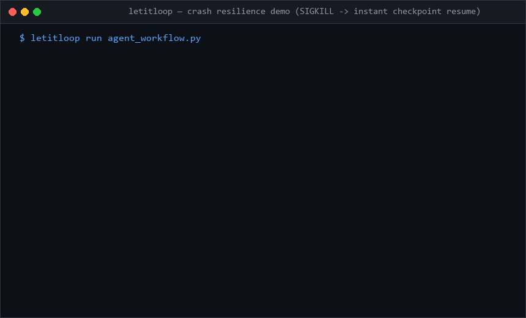

<p align="center">
  
</p>

<div align="center">

# let it loop (LIL)

**Make any Python function crash-proof in 3 lines. Zero tokens wasted on SIGKILL.**

[](https://pypi.org/project/letitloop/)
[](https://github.com/sdageltc/letitloop/actions/workflows/ci.yml)
[](https://github.com/marketplace/actions/letitloop-proof-carrying-pr-verification-gate)
[](https://sdageltc.github.io/agent-durability-bench/)
[](https://www.python.org/downloads/)
[](https://opensource.org/licenses/MIT)

[Quickstart](#quickstart) • [How it Works](#how-it-works-in-30-seconds) • [Framework Cookbooks](#framework-recipes--cookbooks) • [GitHub Action](#github-action-ci-gate) • [Adapters](#supported-worker-adapters) • [Docs](https://sdageltc.github.io/letitloop/)

</div>

<p align="center">
  
</p>

---

## Quickstart

Make any Python function or agent workflow crash-proof in 3 lines:

```python
from letitloop import durable, step


@durable(goal_id="customer_sync")
def sync_workflow():
    # If this process crashes or gets SIGKILLed midway,
    # completed steps are skipped on resume. Zero tokens wasted.
    user = step("fetch", fetch_crm_record, user_id=123)
    summary = step("summarize", call_claude, user)
    return step("notify", send_slack, summary)


if __name__ == "__main__":
    sync_workflow()
```

### Installation

```bash
# Install core durability kernel
pip install letitloop

# Or install with dev & conformance tooling
pip install "letitloop[dev]"
```

---

## How it Works in 30 Seconds

```
[ Step 1: fetch ] ---> ( WAL Append: ~2ms ) ---> [ Step 2: summarize ] ---> ?? SIGKILL / OOM
                                                                                    |
[ Step 1: FAST-FORWARD <1ms ] <----------------------- ( Resume from WAL ) <--------+
          |
          +---> [ Step 2: summarize ] ---> [ Step 3: notify ] ---> ? Done
```

1. **WAL Append (<2ms)**: Each wrapped `step()` atomically commits its return value to a local Write-Ahead Log (`state.wal.jsonl`) with CRC32 framing.
2. **Crash & Containment**: An uncatchable `SIGKILL`, spot instance eviction, API timeout, or out-of-memory fault kills the process.
3. **Instant Zero-Token Resume**: When re-executed, finished steps are loaded directly from disk cache in <1ms?bypassing repeated LLM calls, duplicate external API requests, and wasted compute.

> **⚡ Async Support**: For asynchronous workflows, use `@durable_async` and `await async_step(...)` with full `asyncio.gather()` isolation.

---

## 🧪 Battle-Tested: 250+ Deterministic Simulation Tests (DST)

LetItLoop uses **Deterministic Simulation Testing (DST)** inspired by the distributed systems verification methodologies of **FoundationDB, TigerBeetle, Jepsen, and Antithesis**:

- **OS SIGKILL Chaos Injection**: Tested against 500+ physical OS signal injections (`kill -9`, SIGKILL 137, spot-instance preemptions, and OOM aborts) across all execution boundaries.
- **250 / 250 DST Fault Matrix (100% Passed)**: Systematic fault injection across the 4 durability sentinels (`SENTINEL_PROMPT`, `SENTINEL_EXEC`, `SENTINEL_WRITE`, `SENTINEL_VERIFY`). While raw agent loops fail 100% of the time and naive in-memory graphs fail 87.6% of the time, LetItLoop achieves **100.0% zero-state-loss recovery**.
- **Torn WAL & Bitrot Fuzzing**: 5,000+ property-based fuzzing permutations (via Hypothesis) inject random mid-frame disk writes, torn tails, and single-bit CRC32 corruptions—verifying automatic fail-safe prefix repair without state loss.
- **Multi-OS CI Matrix**: 1,457 unit tests + 250 DST fault matrices running 100% green across Ubuntu (3.11/3.12), macOS (3.11/3.12), and Windows (3.11/3.12).

---

## Framework Recipes & Cookbooks

LetItLoop integrates natively with major AI agent frameworks. Explore runnable self-contained examples:

| Framework | Cookbook | Description |
|---|---|---|
| **LangGraph** | [**Financial Analyst Cookbook**](examples/cookbooks/langgraph_financial_analyst.py) | 4-step `yfinance` + StateGraph equity analysis surviving simulated SIGKILL |
| **DSPy** | [**Prompt Optimizer Cookbook**](examples/cookbooks/dspy_durable_optimize.py) | Async `BootstrapFewShot` / Teleprompter tuning with zero lost progress |
| **CrewAI** | [**Durable Tools Example**](examples/crewai_durable_tools.py) | Multi-agent tool execution with step-level resumption and zero duplicate side-effects |
| **LlamaIndex** | [**Durable Workflows Example**](examples/llamaindex_durable_workflow.py) | Event-driven `@step` pipeline with crash durability and sub-millisecond fast-forward |
| **OpenAI Swarm** | [**Durable Handoff Example**](examples/swarm_durable_handoff.py) | Multi-agent context handoff with WAL v2 serialization |

Run any cookbook directly:
```bash
python examples/cookbooks/langgraph_financial_analyst.py --demo
python examples/cookbooks/dspy_durable_optimize.py --demo
```

---

## GitHub Action CI Gate

Drop LetItLoop into your CI/CD pipeline to block non-deterministic agent changes, enforce AST signatures, and verify proof bundles:

```yaml
name: LetItLoop Proof-Carrying CI Gate
on: [pull_request]

jobs:
  verify:
    runs-on: ubuntu-latest
    steps:
      - uses: actions/checkout@v4
      - name: Set up Python
        uses: actions/setup-python@v5
        with:
          python-version: "3.11"
      - name: Install LetItLoop
        run: pip install letitloop
      - name: Verify PR Proof Bundle
        uses: sdageltc/letitloop-action@v2
        with:
          contract: .letitloop/contract.json
          enforce-ast: true
```

---

## Supported Worker Adapters

LetItLoop provides adapters for leading autonomous coding agents and execution environments:

| Worker Adapter | Identifier | Description | Tier |
|---|---|---|---|
| **Mock Worker** | `mock` | Deterministic simulation worker for offline testing & CI | **Tier-1 (Core)** |
| **Claude Code CLI** | `claude-code` | Autonomous task execution via Claude Code CLI | **Tier-1 (Core)** |
| **Google Antigravity CLI** | `antigravity-cli` | Invokes official `agy` agent runner with process containment | **Tier-1 (Core)** |
| **OpenAI Codex CLI** | `codex` | Autonomous task execution via OpenAI Codex CLI | **Tier-1 (Core)** |
| **OpenCode CLI** | `opencode` | Autonomous execution via OpenCode agent CLI | Tier-2 (Contrib) |
| **Hermes Agent CLI** | `hermes` | Autonomous execution via Nous Research Hermes agent CLI | Tier-2 (Contrib) |
| **Cline CLI** | `cline` | Headless execution via Cline autonomous coding runner | Tier-2 (Contrib) |
| **Aider Pair Programmer** | `aider` | Pair programming execution via Aider CLI | Tier-2 (Contrib) |
| **Docker Sandbox** | `docker` | Containerized worker with workspace directory scoping | Tier-2 (Contrib) |
| **Local LLM Tool Caller** | `local-tool` | Offline Ollama / vLLM local model loop | Tier-2 (Contrib) |
| **Omniroute Gateway** | `omniroute` | Multi-model fallback routing through local/remote gateways | Tier-2 (Contrib) |
| **Script Worker** | `script` | Executes local shell/Python scripts with environment isolation | Tier-2 (Contrib) |
| **Direct LLM APIs** | `direct` | In-process calls to Gemini, OpenAI, Anthropic, DeepSeek | Tier-2 (Contrib) |

> **Community Contributions**: Tier-2 adapters are maintained via community contributions. To add a custom adapter, implement the `WorkerAdapter` interface in `orchestrator/workers/`.

---

## Core Capabilities

- **Source-Span AST Node Splicer**: Replaces targeted functions and class methods with surgical precision. **0% Comment Loss**: Guarantees module docstrings, file comments, licensing headers, and class indentation are never stripped or altered.
- **In-Memory Fast Sandbox**: Zero-Copy `sys.modules` evaluation and Windows Job Object containment that verifies code hypotheses in-memory before writing anything to disk.
- **Fault-Tolerant WAL Supervisor Loop**: State journal with WAL (Write-Ahead Logging), crash recovery, atomic Win32/POSIX file locking, and bounded 3-strike retries with strategy mutation.
- **Model Context Protocol (MCP) Server**: 8 stdio JSON-RPC tools connecting directly with Claude Code, Cursor, Antigravity, and Hermes Agent:
  ```bash
  claude mcp add letitloop -- python -m orchestrator.mcp_server
  ```
- **Zero-Trust Verification Engine**: Deterministic acceptance check kinds (AST syntax parsers, command exit-code assertions, regex matchers, file validators, size bounds, and undeclared output detectors).

---

## Enterprise Compliance, SBOM & CRA

<details>
<summary><b>Click to expand Enterprise Compliance, CRA Invariants & Security Specifications</b></summary>

### EU Cyber Resilience Act (CRA) & SBOM
- **Deterministic Verification**: All agent-generated patches require proof bundles signed with HMAC-SHA256.
- **Software Bill of Materials (SBOM)**: CycloneDX and SPDX format export via `lil sbom --format cyclonedx`.
- **Zero-Trust Redaction**: Automatic masking of PATs, OAuth tokens, AWS credentials, and PEM private keys before logging.
- **Process Orphan Containment**: Windows Job Objects (`JOB_OBJECT_LIMIT_KILL_ON_JOB_CLOSE`) and POSIX session groups ensure orphan processes are reaped on exit.

### Living Architecture Decision Records (ADRs)
- [**ADR-0001**](docs/adr/0001-write-ahead-logging.md): Write-Ahead Logging (WAL) & Zero-State Recovery
- [**ADR-0002**](docs/adr/0002-deterministic-verifiers.md): Deterministic AST, Regex & Exit-Code Verification Gates
- [**ADR-0003**](docs/adr/0003-headless-cli-adapters.md): Zero-API-Key Headless Agent CLI Wrapper Failovers
- [**ADR-0004**](docs/adr/0004-format-aware-acceptance-checks.md): Format-Aware Acceptance Check & Markdown Injection

</details>

---

## License

Distributed under the MIT License. See [LICENSE](LICENSE) for details.
