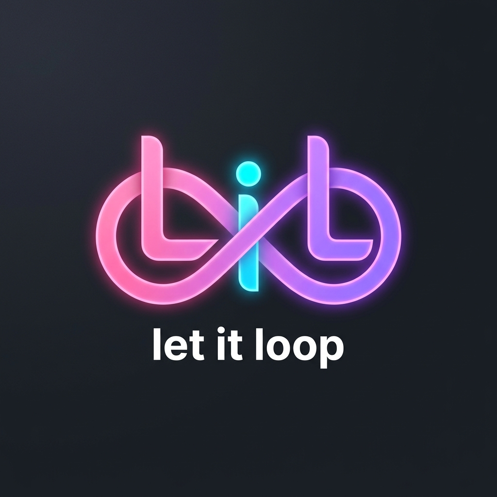

<p align="center">
  
</p>

<div align="center">

# let it loop (LIL)

**Autonomous macro-task orchestration & verification control loop for AI coding agents: 2ms WAL crash durability, source-span AST self-evolution, and deterministic proof gates.**

[](https://pypi.org/project/letitloop/)
[](https://github.com/sdageltc/letitloop/actions/workflows/ci.yml)
[](https://github.com/marketplace/actions/letitloop-proof-carrying-pr-verification-gate)
[](https://github.com/sdageltc/agent-durability-bench)
[](https://www.python.org/downloads/)
[](https://opensource.org/licenses/MIT)

[Official Website](https://sdageltc.github.io/letitloop/) • [DCP-2.0 Benchmark](https://sdageltc.github.io/agent-durability-bench/) • [GitHub Action](https://github.com/sdageltc/letitloop-action) • [Quickstart](#quickstart) • [Cookbook](#recipes--cookbooks)

</div>

<p align="center">
  
</p>

---

## The LetItLoop Tripartite Ecosystem

LetItLoop solves the central failure mode of autonomous AI coding agents: **the lack of deterministic verification, uncatchable mid-task SIGKILL crashes, and destructive whole-file rewrites**.


1. **[`letitloop`](https://github.com/sdageltc/letitloop)**: The core engine providing sub-2ms Write-Ahead Logging (WAL) state journals, source-span AST node splicing (0% comment loss), in-memory Zero-Copy fast sandboxing, and deterministic verification gates.
2. **[`letitloop-action`](https://github.com/sdageltc/letitloop-action)**: Standalone GitHub Action for CI that validates AI pull requests, enforces strict AST signatures, and posts machine-verifiable proof bundles directly to PR comments.
3. **[`agent-durability-bench`](https://github.com/sdageltc/agent-durability-bench)**: An open benchmark suite implementing Durability Challenge Protocol 1.0 (DCP-1.0) with zero-API synthetic simulation to measure how well agents recover from uncatchable SIGKILL crashes.

---

## Key Capabilities

- **Source-Span AST Node Splicer**: Replaces targeted functions and class methods with surgical precision. **0% Comment Loss**: Guarantees module docstrings, file comments, licensing headers, and class indentation are never stripped or altered.
- **In-Memory Fast Sandbox**: Zero-Copy `sys.modules` evaluation and Windows Job Object containment that verifies code hypotheses in-memory before writing anything to disk.
- **Fault-Tolerant WAL Supervisor Loop**: State journal with WAL (Write-Ahead Logging), crash recovery, atomic Win32/POSIX file locking, and bounded 3-strike retries with strategy mutation.
- **Cognitive Feasibility Gate & Multi-Source Research**: Deliberates whether a refactor is safe to perform autonomously or requires background research across arXiv, GitHub, and DuckDuckGo.
- **Human-in-the-Loop Proposal Ledger**: Automatically stages deferred, high-risk architectural proposals as structured markdown artifacts (`PROP-*.md`) for human review rather than executing unverified mutations.
- **Zero-Trust Verification Engine**: Deterministic acceptance check kinds (AST syntax parsers, command exit-code assertions, regex matchers, file validators, size bounds, and undeclared output detectors).
- **12 Pluggable Worker Adapters**: Native interfaces for Claude Code, OpenAI Codex, Google Antigravity (`agy`), OpenCode, Hermes Agent, Cline, Aider, Docker Sandboxes, Local LLMs (Ollama/vLLM), Omniroute gateways, local scripts, and direct LLMs.
- **Native Model Context Protocol (MCP) Server & Client**: 8 stdio JSON-RPC tools connecting directly with Claude Code, OpenAI Codex, Cursor, Google Antigravity, and Hermes Agent.
- **Cross-Platform Process Orphan Guard**: Windows Job Objects (`win32job`) and POSIX session process-group containment ensuring complete cleanup of child/grandchild processes.
- **Prometheus Observability & Signed Webhooks**: Native Prometheus metrics exporter, lifecycle event bus, SSE streaming, and HMAC-SHA256 signed webhook dispatcher.

---

## Quickstart

### 1. The `@durable` Python Decorator (Drop-in Durability)

Embed LetItLoop's crash-resilient WAL kernel directly into your Python functions, LangGraph nodes, or CrewAI agents:

```python
from letitloop import durable, step, atomic_marker


@durable(goal_id="customer_sync")
def main():
    # If your script crashes or gets SIGKILLed midway,
    # completed steps are skipped on resume. Zero duplicate tokens wasted.
    user = step("fetch_user", fetch_crm_record, user_id=123)
    summary = step("llm_summarize", call_claude, user)

    # Guard external mutations against duplicate execution
    with atomic_marker("slack_notification") as should_execute:
        if should_execute:
            step("post_slack", notify_team, summary)


if __name__ == "__main__":
    main()
```

> **⚠️ Resume Semantics Notice**: LetItLoop provides zero-server, single-file WAL durability. Completed steps are never re-executed (**0% duplicate token waste** on finished work). In-flight steps re-execute at-least-once. Design steps to be idempotent or protect external API mutations using LetItLoop's `atomic_marker` primitive.

### 2. Installation

```bash
# Install letitloop core engine
pip install letitloop

# Or install with development and conformance tooling
pip install "letitloop[dev]"
```

### 3. Basic CLI Usage

```bash
# Execute DCP-2.0 durability conformance matrix
lil bench --matrix

# Fast pre-push code repair and AST check
lil heal --target orchestrator/state.py

# Inspect supervisor status, WAL journal, and active checkpoints
lil status

# Scaffold a production GitHub Action PR verification workflow
lil action --init
```

---

## Supported Worker Adapters & Gateways

| Worker Adapter | Identifier | Description | Tier |
|---|---|---|---|
| **Google Antigravity CLI** | `antigravity-cli` | Invokes the official `agy` agent runner safely | **Tier-1 (Core)** |
| **Claude Code CLI** | `claude-code` | Autonomous task execution via Claude Code CLI | **Tier-1 (Core)** |
| **OpenAI Codex CLI** | `codex` | Autonomous task execution via OpenAI Codex CLI | **Tier-1 (Core)** |
| **Mock Worker** | `mock` | Deterministic simulation worker for CI and offline tests | **Tier-1 (Core)** |
| **OpenCode CLI** | `opencode` | Autonomous execution via OpenCode agent CLI | Tier-2 (Contrib) |
| **Hermes Agent CLI** | `hermes` | Autonomous execution via Nous Research Hermes agent CLI | Tier-2 (Contrib) |
| **Cline CLI** | `cline` | Headless execution via Cline autonomous coding runner | Tier-2 (Contrib) |
| **Aider Pair Programmer** | `aider` | Pair programming execution via Aider CLI | Tier-2 (Contrib) |
| **Docker Sandbox Worker** | `docker` | Isolated execution inside container runtime with workspace scoping | Tier-2 (Contrib) |
| **Local LLM Tool Caller** | `local-tool` | Local tool-calling model adapter for offline Ollama/vLLM loops | Tier-2 (Contrib) |
| **Omniroute Gateway** | `omniroute` | Multi-model fallback routing through local/remote gateways | Tier-2 (Contrib) |
| **Script Worker** | `script` | Executes local shell/Python automation scripts with env isolation | Tier-2 (Contrib) |
| **Direct LLM APIs** | `direct` | In-process calls to Gemini, OpenAI, Anthropic, DeepSeek, or Ollama | Tier-2 (Contrib) |

---

## Model Context Protocol (MCP) Integration

LetItLoop runs natively as an MCP server providing 8 JSON-RPC tools to AI agent runners:

```json
{
  "mcpServers": {
    "letitloop": {
      "command": "letitloop-mcp",
      "env": {
        "WORKER_MODEL": "gemini:gemini-3.7-flash",
        "QC_MODEL": "gemini:gemini-3.1-pro"
      }
    }
  }
}
```

#### Add to Claude Code
```bash
claude mcp add letitloop -- python -m orchestrator.mcp_server
```

---

## Recipes & Cookbooks

The [`recipes/`](recipes/README.md) cookbook provides end-to-end, schema-validated walkthroughs:

| Recipe | Focus |
|---|---|
| [**01 - Legacy Codebase Refactor**](recipes/01-legacy-codebase-refactor/README.md) | Refactor under `pytest` + `ruff` acceptance gates with scope fencing and bounded retries |
| [**02 - FastAPI CRUD Generator**](recipes/02-fastapi-crud-generator/README.md) | Feature decomposition into a 4-contract DAG chained with `depends_on` |
| [**03 - Offline Local LLM Loop**](recipes/03-offline-local-llm-loop/README.md) | Zero-cloud-key runs via Ollama (`local-tool`) and the `docker` sandbox adapter |
| [**04 - Multi-Agent QC Audit**](recipes/04-multi-agent-qc-audit/README.md) | Multi-lens quality plane: panels, arbitration, budgets, and `quality_spec` |

Validate all embedded example contracts anytime with `pytest tests/test_recipes.py -q`.

---

## Living Architecture Decision Records (ADRs)

Following the Michael Nygard ADR convention, all core design invariants and architectural decisions are codified:

| ADR | Focus | Status |
|---|---|---|
| [**ADR-0001**](docs/adr/0001-write-ahead-logging.md) | **Write-Ahead Logging (WAL) & Zero-State Recovery** | `accepted` |
| [**ADR-0002**](docs/adr/0002-deterministic-verifiers.md) | **Deterministic AST, Regex & Exit-Code Verification Gates** | `accepted` |
| [**ADR-0003**](docs/adr/0003-headless-cli-adapters.md) | **Zero-API-Key Headless Agent CLI Wrapper Failovers** | `accepted` |
| [**ADR-0004**](docs/adr/0004-format-aware-acceptance-checks.md) | **Format-Aware Acceptance Check & Markdown Injection** | `accepted` |

---

## Security & Sandboxing Architecture

`letitloop` operates under a zero-trust execution model:
- **Redaction Firewall**: Automatic masking of PATs, OAuth keys, AWS credentials, GCP tokens, and PEM private keys.
- **Environment Scrubbing**: Sensitive parent environment variables are stripped prior to worker execution.
- **Scope Checking**: Userland filesystem snapshot diffing (`scope.py`) enforcing directory bounds and declared output paths.
- **Process Isolation**: Process tree containment with Windows Job Objects (`JOB_OBJECT_LIMIT_KILL_ON_JOB_CLOSE`) and POSIX session leadership.

---

## License

Distributed under the MIT License. See [LICENSE](LICENSE) for more details.
