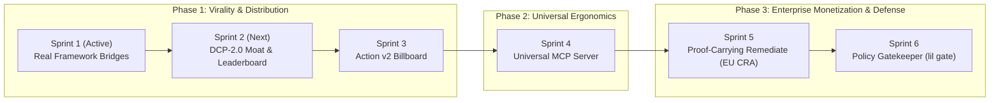

# 🏛️ LetItLoop Scaled Master Roadmap (Sprints 2–6)
**Tribunal Adjudication Status**: `3-0 UNANIMOUS APPROVAL WITH MODIFICATIONS`  
**Adjudicating Panel**: Principal Systems Architect, Head of Enterprise Security & Compliance, Head of AI Product Strategy  
**Operating Cadence**: 24/7 Unattended Autonomous Loop via OpenCode / Antigravity Lead

---

## 🧭 Executive Growth & Systems Architecture Overview



---

## 📋 Comprehensive Sprint-by-Sprint Execution Plans

---

### 🏆 SPRINT 2: DCP-2.0 Conformance Moat & Public Interactive Leaderboard

**Core Value Proposition**: The viral growth engine and open industry benchmark. Demonstrates mathematically and empirically that existing agent frameworks lose 100% of progress on `kill -9`, while LetItLoop resumes in $<30\text{ms}$ with $0\%$ token waste.

#### Technical Scope & Architecture
1. **Anti-Cheat Cryptographic Benchmark Harness (`letitloop/conformance/harness/runner.py`)**:
   - Executes real subprocesses (`subprocess.Popen`) running real framework workflows under physical `SIGKILL` / `taskkill`.
   - Records execution metrics:
     - $T_{\text{resume}}$: Time to state restoration and execution resumption (ms).
     - $W_{\text{token}}$: Duplicate token burn percentage caused by re-executing steps ($0.0\%$ to $100.0\%$).
     - $C_{\text{fail}}$: State corruption count ($0$ for atomic WAL).
     - $K_{\text{window}}$: Specific kill window (`PROMPT`, `EXEC`, `WRITE`, `VERIFY`).
   - Signs benchmark output with HMAC-SHA256 non-reproducible run traces to prevent synthetic spoofing.
2. **Terminal Visualizer & Instant Demo (`lil bench` / `lil demo`)**:
   - `lil demo`: 10-second interactive terminal visualizer showing a 5-step agent loop, injecting a physical `SIGKILL` at Step 3, and demonstrating sub-millisecond cached resume from Step 3 without repeating Steps 1–2.
   - `lil bench --compare all`: Runs the full multi-framework suite and outputs formatted ASCII leaderboard tables.
3. **Auto-Updating Public GitHub Pages Leaderboard (`agent-durability-bench`)**:
   - Automated GitHub Actions workflow (`.github/workflows/benchmark.yml`) running nightly matrix benchmarks.
   - Generates live SVG shields/badges (`docs/badges/durability_score.svg`, `docs/badges/token_waste.svg`).
   - Deploys static interactive comparison site to `https://sdageltc.github.io/letitloop/bench`.

#### Target Files
- `letitloop/conformance/harness/runner.py`: Add anti-cheat trace signatures.
- `orchestrator/cli.py`: Add `lil demo` command and polish `lil bench` flags (`--json`, `--svg`, `--compare`).
- `letitloop/conformance/reporter.py`: Add SVG badge generator and HTML report generator.
- `tests/test_conformance_benchmark.py`: End-to-end benchmark test suite.
- `.github/workflows/benchmark.yml`: Nightly matrix workflow.

#### Machine-Verifiable Exit Gates
- [ ] `lil demo` runs in $<10\text{s}$ and exits with code 0 on Windows, macOS, and Linux.
- [ ] `lil bench --compare all` outputs verified JSON receipts across all 4 scenarios (`DCP-001` through `DCP-004`).
- [ ] Pytest suite passes 100% with 0 regressions in $<60\text{s}$.
- [ ] GitHub Pages benchmark deploy workflow runs green.

---

### 📢 SPRINT 3: Production GitHub Action v2 & Distribution Billboard

**Core Value Proposition**: The viral top-of-funnel billboard. Every CI run on public and private repositories automatically validates AST integrity, verifies WAL transaction logs, and comments with a cryptographic LetItLoop durability certificate.

#### Technical Scope & Architecture
1. **Zero-Dependency TypeScript Action (`letitloop-action/src/index.ts`)**:
   - Compiles down to a single checked-in `dist/index.js` bundle with zero runtime npm dependencies.
   - Pinned to 10/10 OpenSSF Scorecard standards (40-character SHA pinning, least-privilege token permissions).
2. **Deterministic PR Proof Comments**:
   - Posts rich GitHub PR markdown comments with:
     - 🛡️ **LetItLoop Durability Certificate** (Badge + Status).
     - 📊 **Step Execution Summary** (Total steps, cached skips, token savings).
     - 🔒 **Cryptographic Proof ID** (HMAC-SHA256 signature linking base/head commits).
     - 📜 **AST Integrity Verdict** (Syntax tree validation, scope violation checks).
3. **Fail-Closed Fast Verification Gate**:
   - Runs in $<2.5\text{s}$ on CI runners.
   - Fails closed if WAL records contain broken hash chains, uncommitted writes, or corrupted frames.

#### Target Files
- `letitloop-action/src/index.ts`: Native TypeScript Action logic.
- `letitloop-action/action.yml`: Action metadata, inputs, and outputs.
- `letitloop-action/scripts/verify_ast.py`: Python AST validation bridge.
- `letitloop-action/__tests__/action.test.ts`: Jest action test suite.
- `.github/workflows/letitloop-verify.yml`: Canonical example workflow template.

#### Machine-Verifiable Exit Gates
- [ ] `npm run build` produces byte-deterministic `dist/index.js`.
- [ ] `npm test` passes 100% with mock GitHub Actions runner context.
- [ ] End-to-end integration test runs in GitHub Actions, commenting on a test PR.
- [ ] Release `v2.0.0` published to GitHub Marketplace.

---

### 🔌 SPRINT 4: Universal IDE / MCP Durability Server (`letitloop-mcp`)

**Core Value Proposition**: Seamless integration with the modern AI IDE ecosystem (Cursor, Windsurf, Claude Code, Cline). Allows developers to give any AI coding agent instant checkpointing and AST rollback capabilities with zero code changes.

#### Technical Scope & Architecture
1. **Lightweight MCP Protocol Server (`orchestrator/mcp_server.py`)**:
   - Implements Model Context Protocol (MCP) JSON-RPC over `stdio` and `SSE`.
   - Exposes core durability tools:
     - `checkpoint_state(goal_id, payload)`: Writes an atomic `LILWAL02` frame.
     - `rollback_ast(file_path, backup_ref)`: Safely restores an AST node without corrupting surrounding code.
     - `verify_scope(file_path, allowed_patterns)`: Checks if an agent modification violated declared boundaries.
     - `emit_receipt(goal_id)`: Generates an HMAC-sealed proof receipt for the completed task.
2. **Idempotency & Reconnect Resilience**:
   - Binds MCP `requestId` to the internal WAL sequence counter. If an IDE disconnects or crashes, re-sending the same tool request fast-forwards instantly from the WAL without duplicate side effects.
3. **Workspace Root Jailing**:
   - Enforces strict path jailing: tool requests attempting to access paths outside `CWD` or declared worktrees fail closed with `SecurityError`.

#### Target Files
- `orchestrator/mcp_server.py`: Standard MCP server implementation.
- `letitloop/mcp/__init__.py`: Package entrypoint for `npx @modelcontextprotocol/inspector` and `lil mcp`.
- `tests/test_mcp_server.py`: Comprehensive JSON-RPC and stdio integration tests.
- `docs/MCP_SETUP.md`: Setup guide for Cursor (`.cursor/mcp.json`), Windsurf, and Claude Desktop.

#### Machine-Verifiable Exit Gates
- [ ] `npx @modelcontextprotocol/inspector` connects and executes all 4 tools successfully.
- [ ] Disconnecting and reconnecting during an active checkpoint resumes state without data corruption.
- [ ] Path traversal attacks outside the workspace directory are rejected with `SecurityError`.
- [ ] `lil mcp` CLI subcommand starts the stdio server cleanly.

---

### 🛡️ SPRINT 5: Proof-Carrying Auto-Remediation Engine (`lil remediate` — EU CRA Article 10/11 Wedge)

**Core Value Proposition**: The high-value enterprise compliance engine. Automatically scans repositories for vulnerable dependencies, patches them in isolated worktrees, runs regression test suites under process containment, and outputs legally defensible, cryptographic `ProofReceipt`s.

#### Technical Scope & Architecture
1. **Decoupled Vulnerability Remediation Contract (`orchestrator/remediate.py`)**:
   - Ingests standard vulnerability findings (OSV / GitHub Security Advisories / Dependabot alerts).
   - Operates entirely via normalized JSON contracts (`RemediationSpec`), keeping third-party scanners decoupled from the core kernel.
2. **Ephemeral Sandboxed Worktree Isolation**:
   - Spawns an isolated Git worktree using `.merge_admission.lock`.
   - Bumps package version in `pyproject.toml`, `requirements.txt`, or `package.json`.
   - Runs reproduction test suites under `ProcessLifecycleGuard` with network egress disabled (`--net=none`) to prevent supply-chain exfiltration.
3. **Asymmetric / Keyless Cryptographic Attestation**:
   - Upgrades `ProofReceipt` from symmetric HMAC to **Asymmetric Ed25519** and **Sigstore / GitHub OIDC Keyless Attestations**.
   - Binds:
     1. Base commit SHA + Patched commit SHA.
     2. CycloneDX / SPDX SBOM diff.
     3. Test execution stdout/stderr SHA-256 hash.
     4. Deterministic timestamp + unique nonces.
4. **Automated Pull Request Generation**:
   - Opens an auditable pull request containing the clean diff, test replay log, and signed `proof_receipt.json`.

#### Target Files
- `orchestrator/remediate.py`: Core remediation workflow and CLI command `lil remediate`.
- `orchestrator/crypto.py`: Asymmetric Ed25519 signing and verification.
- `orchestrator/sbom.py`: CycloneDX / SPDX lightweight SBOM diff generator.
- `tests/test_remediate.py`: End-to-end auto-remediation test suite with mock CVE packages.

#### Machine-Verifiable Exit Gates
- [ ] `lil remediate --package <name> --target-version <v>` performs clean worktree upgrade and commits changes.
- [ ] `ProofReceipt` verifies cryptographically using public key / OIDC claims.
- [ ] Failed test suites trigger clean rollback without leaving orphaned git branches or dirty files.
- [ ] 0 network egress during test execution phase.

---

### 🚦 SPRINT 6: Enterprise Deterministic Policy Gatekeeper (`lil gate`)

**Core Value Proposition**: Deterministic policy enforcement for AI coding agents. Enforces token ceilings, AST modification boundaries, and automated secret masking before untrusted agent outputs can mutate codebases or leak into audit logs.

#### Technical Scope & Architecture
1. **Deterministic Policy Rules Engine (`orchestrator/gate.py`)**:
   - Validates agent actions against declarative policy files (`letitloop.policy.json`):
     - **AST Modification Limits**: Max lines changed, forbidden files (e.g. CI workflows, security keys).
     - **Token Budget Ceilings**: Strict cost cap per goal execution.
     - **Path Jailing**: Blocks directory traversal (`..`, symlink swaps).
2. **Automated Secret & Entropy Scrubber**:
   - Scans all prompts, AST diffs, and tool outputs for high-entropy strings, API keys, and private tokens before persisting to `state.wal.jsonl`.
   - Masks secrets with `<secret:REDACTED>` markers to prevent credential leakage into git history.
3. **Fail-Closed CI Integration**:
   - `lil gate --check`: Evaluates the current branch against security invariants; returns exit code 0 on PASS, 1 on policy violation.

#### Target Files
- `orchestrator/gate.py`: Policy evaluation engine and `lil gate` CLI command.
- `orchestrator/scrubber.py`: High-entropy string and regex secret scrubber.
- `tests/test_gate.py`: Policy violation and boundary rejection test suite.

#### Machine-Verifiable Exit Gates
- [ ] Modifying a forbidden file (e.g. `.github/workflows/ci.yml`) is blocked immediately.
- [ ] Attempting to write an API key (e.g. `sk-...`) masks the token in the WAL.
- [ ] Exceeding the token budget halts execution cleanly with `BudgetExceededError`.
- [ ] Full test suite completes in $<60\text{s}$ with 0 failures.

---

## 📅 Roadmap Execution Master Checklist

```
Sprint 1: Real Framework Integrations & Examples (ACTIVE IN OPENCODE)
- [ ] examples/langgraph_durable_pipeline.py
- [ ] examples/crewai_durable_tools.py
- [ ] tests/test_framework_examples.py

Sprint 2: DCP-2.0 Conformance Moat & Public Leaderboard
- [ ] Anti-cheat cryptographic run trace signatures in runner.py
- [ ] lil demo 10-second interactive terminal visualizer
- [ ] Auto-updating GitHub Pages benchmark matrix (.github/workflows/benchmark.yml)
- [ ] Live SVG badge generators (durability_score.svg, token_waste.svg)

Sprint 3: Production GitHub Action v2
- [ ] Zero-dependency TypeScript bundle (dist/index.js)
- [ ] Rich PR summary markdown comment generator
- [ ] OpenSSF Scorecard 10/10 hardening
- [ ] GitHub Marketplace v2.0.0 Release

Sprint 4: Universal IDE / MCP Durability Server
- [ ] orchestrator/mcp_server.py stdio/SSE server
- [ ] Idempotent tool execution bound to WAL sequence
- [ ] Workspace root path jailing
- [ ] lil mcp CLI entrypoint

Sprint 5: Proof-Carrying Auto-Remediation Engine (EU CRA)
- [ ] orchestrator/remediate.py & lil remediate CLI
- [ ] Asymmetric Ed25519 / OIDC keyless ProofReceipt signing
- [ ] Isolated worktree sandbox with network egress blocking
- [ ] CycloneDX SBOM diff attestation

Sprint 6: Enterprise Deterministic Policy Gatekeeper
- [ ] orchestrator/gate.py & lil gate CLI
- [ ] Automated high-entropy secret scrubber
- [ ] AST boundary and token ceiling circuit breakers
```
