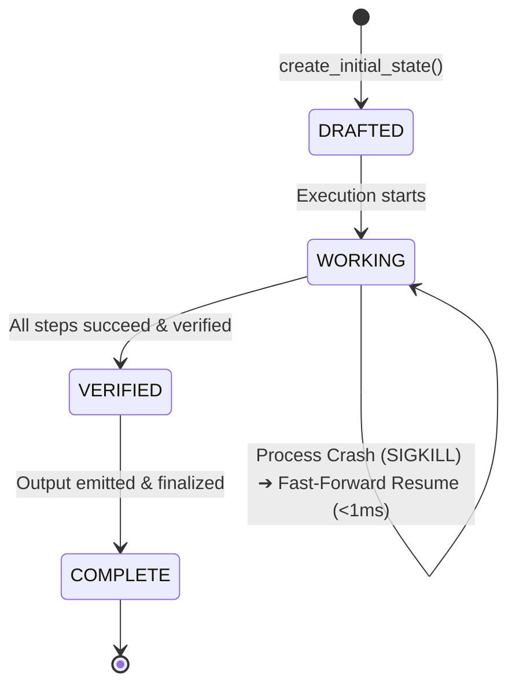
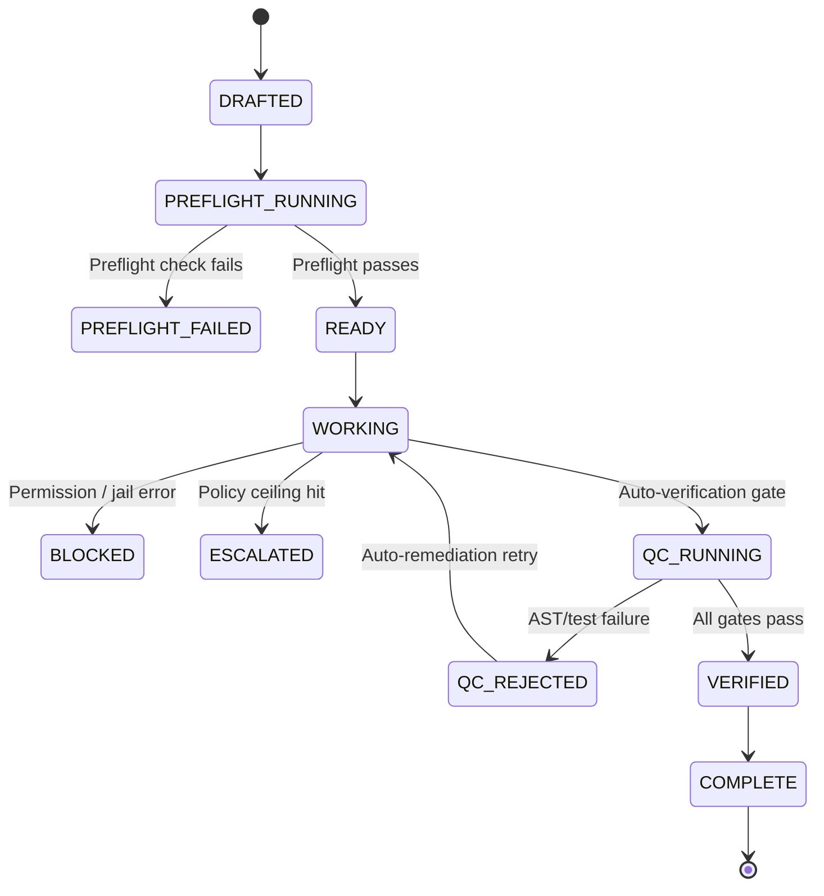

# LetItLoop State Machine

LetItLoop uses an event-sourced state machine anchored by an append-only Write-Ahead Log (`LILWAL02` CRC32-framed format).

---

## 🌟 The 4-State Happy Path (`@durable`)

For 95% of Python developers using the `@durable` and `@durable_async` decorators, LetItLoop operates on a clean, minimal 4-state lifecycle:

### Happy Path State Invariants:
1. **`DRAFTED`**: Initial state container initialized with target `goal_id`.
2. **`WORKING`**: Function execution in progress. Each `step("name", fn)` records an atomic WAL frame and stores completed step outputs in `state.data["step_outputs"]`. On restart after `SIGKILL`, already-recorded steps skip re-execution with O(1) fast-forward lookup.
3. **`VERIFIED`**: Function return value captured, atomic markers finalized, and execution verified against postconditions.
4. **`COMPLETE`**: State machine terminal state. Lock released, final snapshot written atomically (`tmp + os.replace + fsync`).

---

## 🏛️ Full 22-State Governance Machine (CLI & Enterprise)

For multi-agent supervisory loops (`lil supervise`), human-in-the-loop gates, and EU CRA compliance audits, LetItLoop provides an expanded state graph with fail-closed transitions:

